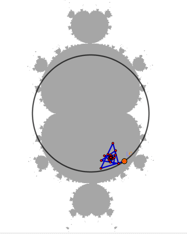
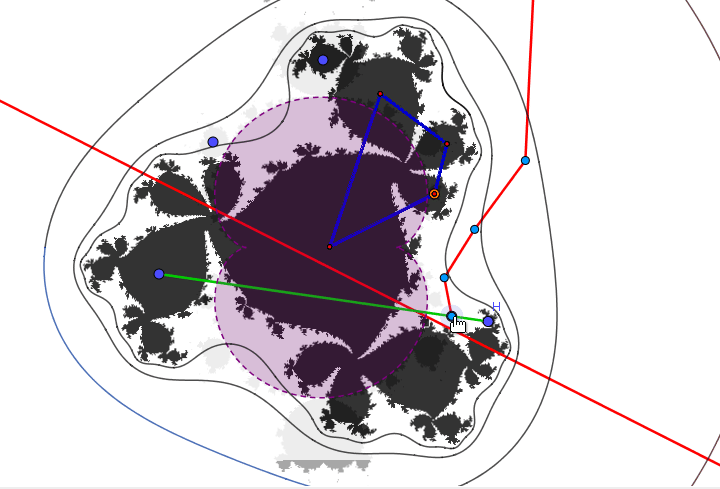

---
output:
  pdf_document: default
  html_document: default
  word_document: default
---

# Dinamica discreta compleja {#ww}

## Iteración de funciones complejas 

Se define
como la **composición reiterada** de $f$ consigo misma $k$ veces y la
denotamos por $f^{k}$  donde
$f^{k+1}=f\circ f^{k}.$
Ademas $f^{1}=f$ y $f^{0}=id.$ La  órbita de $x$ bajo $f$ como la **sucesión** 
$x,f(x),f^{2}(x),f^{3}(x),\ldots,f^{k}(x),\ldots$

Dado un punto periódico $z_{0}$ con periodo $k,$ se define el número
**$\lambda$**, llamado el **valor propio** o **el multiplicador**
\[
\lambda=\begin{cases}
\left(f^{k}\right)'(z_{0})=\prod_{i=0}^{k-1}f'\left(z_{i}\right) & \mbox{si}\ z_{0}\neq\infty\\
\frac{1}{\left(f^{k}\right)'(z_{0})} & \mbox{si}\ z_{0}=\infty.
\end{cases}
\]
 

$z_{0}$ es un **punto fijo** de $f$ si verifica la ecuación
**$f(z_{0})=z_{0}.$**
Un punto fijo $z$ de $f$, es periódica, de periodo 1.

* Puntos eventualemente periódicos

* Puntos eventualmente periódico-repelentes

* Cuencas superactractoras (inmediata)

##  Conjuntos de Fatou y Julia $\mathcal{K}$, $\mathcal{J}$ y $\mathcal{F}$ {#fatou}

El **conjunto lleno de Julia** asociado a
una función $f$: $\mathcal{k}=\mathcal{K}(f)$ esta formado por $z\in\mathbb{C}_\infty$, donde la secuencia definida $z_{0}=z,z_{n+1}=f\left(z_{n}\right)$,
(órbita positiva) de $z,$ **no converge a infinito**; y el **conjunto de
Julia** es la frontera del **conjunto lleno de Julia** es decir $\mathcal{J}=\partial\mathcal{K}$.

El **conjunto de Fatou**, asociado a $f,$ lo cual se denota como $\mathcal{F}=\mathcal{F}(F)$ es aquel conjunto de todos
los $z\in\mathbb{C}_\infty$, para los cuales la secuencia definida por inducción
por $z_{0}=z,z_{n+1}=f\left(z_{n}\right)$, **no converge a infinito**  

{width=280}{width=380}

##  Plano de parámetros generado por $Q_{p,c}=z ^p+c$ {#plano1}

Es un conjunto de puntos llamados **parámetros**,
definida por una función compleja $f$, que contiene un parámetro
$c$, es decir $f_{c}(z)$, donde viven los conjuntos acotados (Multibrots)
\[
\mathcal{Q}:=\left\{c\in\mathbb{C}:\left\{f_{c}^{m}(0)\right\}_{m=1}^{\infty}\text{ es acotada}\right\}
\]
\[
\mathcal{M}^p:=\left\{c\in\mathbb{C}:\left\{Q_{c,p}^{m}(0)\right\}_{m=1}^{\infty}\text{ es acotada}\right\}
\]
de manera que este conjunto, divide al plano de parámetros ($\mathcal{C}_\infty$)
en dos conjuntos complementarios $\mathcal{Q}$ y $\mathbb{C}_{\infty}\setminus\mathcal{Q}$.

{width=300}

##  Plano dinámico generado por $Q_{p,c}=z ^p+c$ ($\mathcal{C}_\infty$) {#plano2}
Este plano esta estructurado con los **conjuntos de Julia** cuyas propiedades dependen de la **ubicación del parámetro c** en relación a los conjuntos Multibrot, mencionado en la definición del plano de parámetros. [C3](#www)

{width=500}
