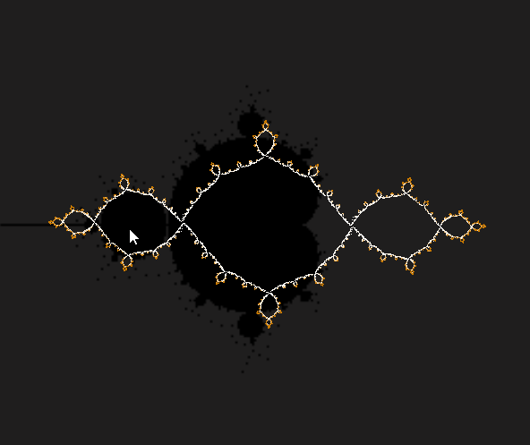
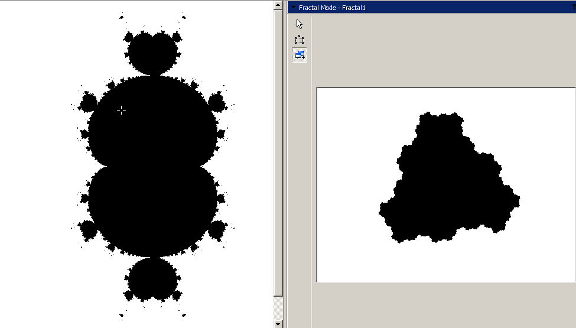

---
output:
  pdf_document: default
  html_document:
    font: "sans-serif"
  word_document: default
---


# Relaciones topólogicas entre los conjuntos Multibrot y Julia {#www}
\@ref(we) \@ref(ww) \@ref(www)

  
```{r, include =FALSE}
w1<-"El parámetro $c$ pertenece al conjunto Multibrots, si, y solo si el 
conjunto de Julia asociado a este parámetro, es simplemente conexa, además el complemento del
conjunto lleno de Julia es conexa"
w2<-"Los conjuntos Multibrots y de Julia son similares, en un
 entorno de un punto de Misiurewicz"
w3<-"Si un parámetro $c$ pertenece a una componente hiperbólica del conjunto 
Multibrots de periodo 1, entonces el conjunto de Julia es una curva de 
Jordan"
w4<-"Si un parámetro $c$ es un punto periódico superactractivo, de periodo $k$, entonces existen puntos eventualmente periódicos en el conjunto de Julia con periodo $k$ y $N > 1$, que son las imágenes inversas de los elementos de la órbita"
w5<-"Si un parámetro $c$ pertenece al conjunto Multibrots, entonces el conjunto
de Julia es un subconjunto propio del conjunto lleno de Julia y si este no pertenece al conjunto de Multibrots, el conjunto de Julia es igual al conjunto lleno de Julia"
```
## Hipótesis 1
`r w1`
<!--- 
[Canvas](http://www.malinc.se/m/JuliaSets.php)
{width=500}

## Hipótesis 2
`r w2`

{width=200}{width=200}

## Hipótesis 3
`r w3`

{width=700}

## Hipótesis 4
`r w4`

{width=200}

## Hipótesis 5
`r w5`

{width=200}
-->
