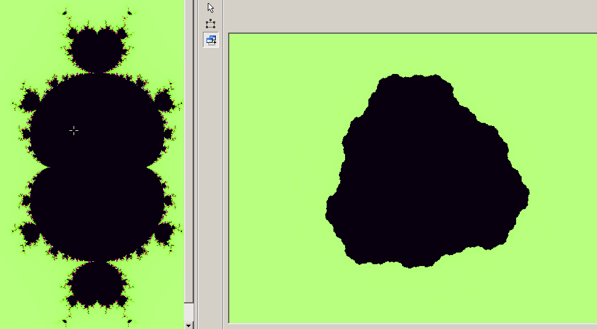

---
output:
  pdf_document: default
  html_document:
    font: "sans-serif"
  word_document: default
---


# Relaciones topólogicas entre los conjuntos Multibrot y Julia {#www}

  
```{r, include =FALSE}
w1<-"El parámetro $c$ pertenece al conjunto Multibrots, si, y solo si el 
conjunto de Julia asociado a este parámetro, es simplemente conexa, además el complemento del
conjunto lleno de Julia es conexa"
w2<-"Los conjuntos Multibrots y de Julia son similares, en un
 entorno de un punto de Misiurewicz"
w3<-"Si un parámetro $c$ pertenece a una componente hiperbólica del conjunto 
Multibrots de periodo 1, entonces el conjunto de Julia es una curva de 
Jordan"
w4<-"Si un parámetro $c$ es un punto periódico superactractivo, de periodo $k$, entonces existen puntos eventualmente periódicos en el conjunto lleno de Julia con periodo $k$ y $N > 1$, que son las imágenes inversas de los elementos de la órbita"
w5<-"Si un parámetro $c$ pertenece al conjunto Multibrots, entonces el conjunto
de Julia es un subconjunto propio del conjunto lleno de Julia y si este no pertenece al conjunto de Multibrots, el conjunto de Julia es igual al conjunto lleno de Julia"
```

## Hipótesis 1
`r w1`: <span style="color:red">$$c\in \mathcal{M}^p\Longleftrightarrow \mathcal{J}_c^p \text{ es conexa}$$ </span>


{width=450}

[](#plano2)

## Hipótesis 2
`r w2`: <span style="color:red"> $\forall r>0$, $$\lim_{k\to\infty}\left[\rho_{k}^{-1}\left(\mathcal{J}_{c_{0}}^{p}-c_{0}\right)\right]_r\rightarrow\left[\mathcal{J}'\right]\leftarrow \lim_{k\to\infty} \left[q\rho_{k}^{-1}\left(\mathcal{M}^{p}-c_{0}\right)\right]_r$$ con la topología de Hausdorff.  </span> 

{width=350}{width=350}

## Hipótesis 3
`r w3`: <span style="color:red">$$c\in \mathcal{H}_1^p\Longleftrightarrow \mathcal{J}_c^p \text{ es una curva de Jordan}$$ </span>

{width=600}

## Hipótesis 4
`r w4`: <span style="color:red">$c\in \mathcal{M}^p$  tal que  $\left(f^{k}\right)'(c)=0$  entonces $\exists z\in\mathcal{K}$  tal que $f^{n+k}(z)=f^{n}(z)$, $\forall n>N$</span>

{width=500}

## Hipótesis 5
`r w5`: <span style="color:red">$$c\in \mathcal{M}^p\Longrightarrow\mathcal{J}_c^p\subset\mathcal{K}_c^p$$  $$c\notin \mathcal{M}^p\Longrightarrow\mathcal{J}_c^p=\mathcal{K}_c^p$$ </span>

{width=600}


