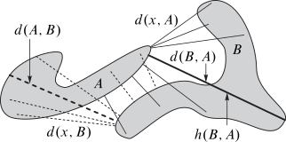

--- 
title: Relaciones topológicas entre los conjuntos Multibrots y de Julia generados
  por el polinomio ${z^p+c}$
author: "MALLQUI BAÑOS Ricardo Michel"
date: "`r Sys.Date()`"
output:
  pdf_document: default
  html_document:
    css: style.css
  word_document: default
description: This is a minimal example of using the bookdown package to write a book.
  The output format for this example is bookdown::gitbook.
documentclass: report
fontsize: 12pt
link-citations: yes
bibliography:
- book.bib
- packages.bib
site: bookdown::bookdown_site
subparagraph: yes
biblio-style: apalike
---

\newcommand{\N}{\mathbb{N}}
\newcommand{\R}{\mathbb{R}}
\newcommand{\CC}{\mathbb{C}}
\newcommand{\I}{\mathbb{I}}
\newcommand{\f}{\mathbb{f}}
\newcommand{\X}{\mathbb{X}}
\newcommand{\D}{\mathbb{D}}
\newcommand{\Z}{\mathbb{Z}}
\newcommand{\Q}{\mathbb{Q}}

\newcommand{\norm}[1]{\left\Vert#1\right\Vert}
\newcommand{\abs}[1]{\left\vert#1\right\vert}
\newcommand{\set}[1]{\left\{#1\right\}}
\newcommand{\seq}[1]{\left<#1\right>}
\newcommand{\co}[1]{\left[#1\right]}
\newcommand{\cc}[1]{\left(#1\right)}

\newcommand{\J}{\mathcal{J}}
\newcommand{\K}{\mathcal{K}}
\newcommand{\M}{\mathcal{M}}
\newcommand{\F}{\mathcal{F}}
# Preliminares {#we}

## Topología de los números complejos                      
### Espacio métrico
[@Barnsley]  $(X,d)$, espacio métrico

* $d(a,b)\geq0$.
* $d(a,b)=0\Longleftrightarrow a=b$.
* $d(a,b)=d(b,a)$ (axioma de simetría).
* $d(a,b)\leq d(a,c)+d(c,b)$ (desigualdad triangular)

Para todo $a,b$ 
y $c$ en $X$.  


[@articlechurchil] se tiene que $\CC$
$$d(z,w)=\sqrt{\cc{x_{1}-x_{2}}^{2}+\cc{y_{1}-y_{2}}^{2}},$$
[](#conjunto)
           
### Conjuntos compactos {#conjunto}
 
Sea $A$ subconjunto de un espacio métrico $X$, decimos que $A$
es compacto si para cada cubierta abierta $\mathcal{C}$ de $A$ existe
una subcubierta finita $\mathcal{C}'.$


### Conjuntos conexos    
 
Decimos que el espacio $X$ es conexo
si, para todos los conjuntos abiertos $U$ y $V$ en $X$, no
vacíos, de modo que $X\subset U\cup V$, se tiene $U\cap V\neq\emptyset$.
En otras palabras, $X$ no puede ser cubierto por dos conjuntos abiertos
disjuntos.
 
1. Conexidad por trayectorias   
 
2. Conjuntos convexos       
 
3. Componentes conexas      
 
### Sucesiones             

Una sucesión en un conjunto $X$ es una función de los naturales en
$X$. Designamos por $x_{n}$ al $n$ – ésimo término de la sucesión
es decir, a la imagen de $n$ a través de la función $\set{x_{n}}_{n\in\mathbb{N}}$.

Decimos que una sucesión $\set{x_{n}}$ en un espacio métrico $({X,d})$
es convergente en $X$ si existe un punto $p\in X$ con la propiedad
de que $\forall\epsilon\geq0,$ $\exists N\in\mathbb{N}:\forall n\geq N,$
$d(p,x_{n})<\epsilon$. 


### El plano extendido complejo    

En esta sección se recopilará información acerca de la topología del
plano complejo asociado al número $\infty$ siendo esto posible con
la ayuda de la esfera de Riemann. De acuerdo a [@rudin] el conjunto
$\mathbb{C}_{\infty}=\mathbb{C}\cup\set{\infty}$ se llama \emph{plano complejo
ampliado}, ($\infty\notin\mathbb{C}$). En $\mathbb{C}$ adoptamos la aritmética
usual con $\infty$. $\mathbb{C}_{\infty}$ se le dota de una topología para
la cual es un espacio compacto, es decir los entornos de los puntos
de $a\in\mathbb{C}$ son por definición los entornos en $\mathbb{C}_{\infty}$ y
para $a=\infty$ una base de entornos en $\mathbb{C}_{\infty}$ viene dada
por $V_{r}=\set{z\in\mathbb{C};\abs{z}>r}\cup\set{\infty},$ tomando todos
los $r>0$. $\mathbb{C}$ se puede identificar con 
$$S=\set{(x,y,z)\in {\mathbb{R}^{3}}; x^{2}+y^{2}+z^{2}=1}.$$

### Topología de Hausdorff      

Sea $(X,d)$ un espacio métrico completo. Entonces $\mathfrak{H}(X)$
denota el espacio cuyos puntos son los subconjuntos compactos no vacíos
de $X.$
Sea $x\in X$, $A$ y $B\in\mathfrak{H}(X)$.
\[
d(x,B)=\min\set{d(x,y):y\in B}.
\]
\[
d(A,B)=\max\set{d(x,B):x\in A}.
\]
\[
h(A,B)=d(A,B)\vee d(B,A).
\]
```{r ww, echo=FALSE, include=TRUE, fig.align="center",fig.cap="Distancia de Housdorff", out.width ='50%'}

```
[](#compleja)

## Trasformaciones de variable compleja  {#compleja}
 
### Transformación de Möbius           
 
las transformaciones de Möbius $T:\mathbb{C}_{\infty}\rightarrow\mathbb{C}_{\infty}$
no constantes, son definidas mediante funciones racionales de la forma
\[
T(z)=\frac{az+b}{cz+d},
\]
donde $a,b,c,d\in\mathbb{C}_{\infty},$ $ad-bc\neq0$ donde se utilizan
las convenciones funcionales habituales $T(\infty)=a/c$ además $T(-d/c)=\infty$
si $c\neq0$ $T(\infty)=\infty$ si $c=0.$ Para cada $w\in\mathbb{C}_{\infty}$
la ecuación $T(z)=w$ tiene una única solución 
\[
z=T^{-1}(w)=\frac{dw-b}{-cw+a}
\]
luego $T^{-1}$ sigue siendo una transformación del mismo tipo.
[](#holomorfa)


### Transformaciones holomorfas y analíticas  {#holomorfa}
 
 Dado un dominio $\Omega$ y $f:\Omega\rightarrow\mathbb{C}$
una función, decimos que $f$ es holomorfa en $z_{0}\in\Omega$ si
el cociente 
\[
\frac{f(z_{0}+h)-f(z_{0})}{h}
\]
converge a un único límite cuando $h\rightarrow0$ (donde $h\in\mathbb{C},h\neq0$
y $z+h\in\Omega$). Si el limite existe, entonces decimos que la derivada
(compleja) de $f$ en $z_{0}$ esta dada por 
\[
f'(z_{0})=\lim_{h\rightarrow\infty}\frac{f(z_{0}+h)-f(z_{0})}{h}.
\]
[](#conforme)

### Transformaciones conformes {#conforme}     
 
 Una transformación conforme es una función $f:A\rightarrow\mathbb{C},$
diferenciable en ${z_{0}\in A\subset\mathbb{C}},$ que preserva el
ángulo que dos curvas $\alpha\colon[a,b]\rightarrow A$ y $\beta\colon[a,b]\rightarrow A,$
diferenciables en ${\alpha^{-1}\,(z_{0})}$ y ${\beta^{-1}\,(z_{0})},$
respectivamente, forman entre sí en $z_{0}$. Es decir $f$ es conforme
en $z_{0}$ cuando se verifica 
\[
\arg\left[\frac{\left(f\circ\alpha\right)'(z_{0})}{\left(f\circ\beta\right)'(z_{0})}\right]=\arg\left(\frac{\alpha'(z_{0})}{\beta'(z_{0})}\right),
\]
siempre y cuando $\alpha'(z_{0})$ y ${\beta'(z_{0})\,}$ sean vectores
tangentes no nulos. [](#conjugac)


### Conjugación analítica  {#conjugac}                        

Sean $f$ y $g$ transformaciones complejas, de acuerdo a [@Carleson]:
Decimos que una función $f$ : $U\rightarrow U$ es conformalmente
conjugado a una función $g:V\rightarrow V$ si existe una transformación
conforme $\varphi:U\rightarrow V$ tal que $g=\varphi\circ f\circ\varphi^{-1}$,
es decir, tal que 
\[
\varphi(f(z))=g(\varphi(z))
\]
Las transformaciones $f$ y $g$ se pueden considerar como las mismas
transformaciones visto en diferentes sistemas de coordenadas [C2](#ww)

